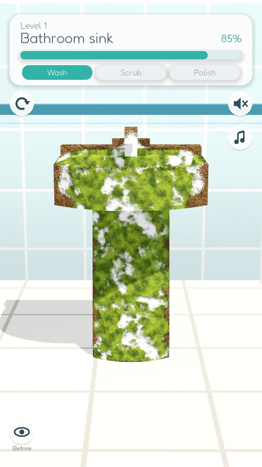
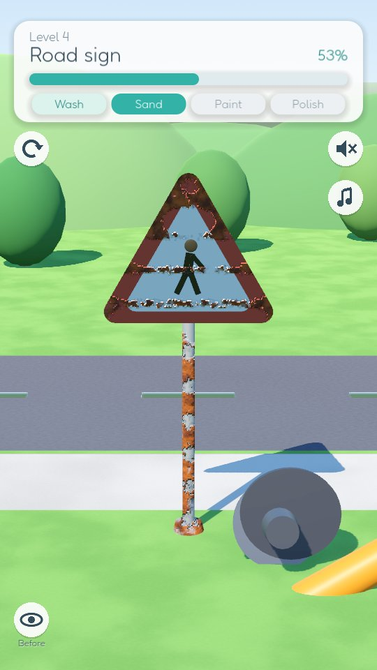
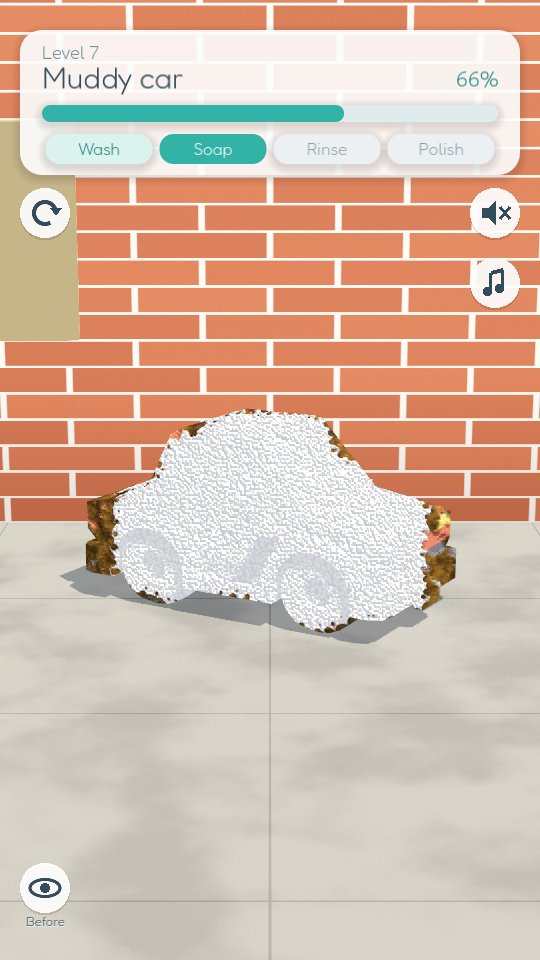

# Spotless

A calm 3D cleaning and makeover game for Android. Each level puts one dirty old thing
in front of you (a mossy sink, a tarnished trophy, a muddy car, a rusty road sign) and
you bring it back to new with a pressure washer, soap foam, a sponge, a grinder, spray
paint and a polisher. **No ads, no in-app purchases, no timers, no analytics.**

It is a clean take on the "satisfying cleaning ASMR" games on the Play Store
(Perfect Makeover: Cleaning ASMR, House Makeover, Cleaning Simulator Wash): the part
that feels good, without the ad wrapper.

  
  
  

## Download

**Direct APK download:**
https://github.com/Matswm86/spotless/releases/download/latest/spotless.apk

1. Open that link in your phone's browser and tap to download.
2. When you open the file, Android may ask you to allow installs from this source.
   Tap **Settings**, turn on **Allow from this source**, go back and install.
3. The app appears as **Spotless**.

The APK is debug-signed with a stable key, so a newer build installs over an older one
and keeps your progress.

## How to play

Drag your finger over the object. The tool sits just above your finger so you can see
what it is doing. The bar at the top fills as you work, and each step finishes by itself
once most of the object is done, so you never hunt for the last speck.

| Step | Tool | What it does |
|---|---|---|
| Tidy up | your hand | Tap the rubbish; it flies into the bin |
| Wash / Rinse | pressure washer | Blasts mud and dust off, rinses foam away |
| Vacuum | hand vacuum | Sucks up dust from fabric |
| Soap | foam gun | Covers grime in foam, ready to be rinsed |
| Scrub | sponge | Wipes off stains, moss, grease and limescale |
| Sand | angle grinder | Grinds off rust, with sparks |
| Paint | spray gun | Pick one of four colours and spray a new coat |
| Polish | polisher | Brings back the shine |

Hold the **eye** button to see the object as it was before you started.

## Levels

17 objects in 7 rooms, then the list repeats with new dirt patterns:
bathroom sink, golden cup, armchair, road sign, desk fan, toilet, muddy car, fridge,
mailbox, bathtub, old kettle, stove, sofa, kick scooter, retro TV, washing machine,
tractor.

## How it works

- Every object has one shader (`scripts/dirt.gdshader`) with five layers: loose dirt,
  grime, new paint, foam and polish. A 192x192 mask, projected from the camera onto
  the object, says how much of each layer is left at each spot.
- Your finger stamps soft circles into that mask (`scripts/CleanMask.gd`), so dirt
  comes off exactly where the tool passes, with ragged, natural edges.
- Progress is measured on a 64x64 grid of rays cast at the object, counting only the
  spots where that layer is actually visible.
- All sound is synthesised by `tools/make_audio.py` (numpy + scipy, no samples):
  a slow electric-piano and music-box loop, and a looping sound per tool (water hiss,
  foam crackle, sponge strokes, grinder whine, spray can, polisher hum, vacuum).
  Tool sounds swell while the tool touches the object and fade when you lift your finger.

## Credits

- 3D furniture and vehicles: [Kenney](https://kenney.nl) Furniture Kit and Car Kit (CC0).
  The trophy, fan, road sign, mailbox, kettle, scooter, tools and rubbish are built
  from code.
- App icon (`icon.png`, also `store/promo/assets/icon.png`): drawn in code by
  `tools/make_icon.py` (PIL shapes only, no outside art). Re-running it rebuilds the
  same file byte for byte.
- Font: [Fredoka](https://github.com/google/fonts/tree/main/ofl/fredoka)
  (SIL Open Font License, see `assets/fonts/OFL.txt`).

## Run from source

1. Install **Godot 4.6.x** from https://godotengine.org/.
2. Import `project.godot` and press **F5**. The mouse works as a finger.

`store/`, `screenshots/` and `tools/` hold a `.gdignore`, so Godot never imports or packs them.

## Inside MWM Play (family app)

- Touch rules for young children: every button, swatch and rubbish target is at least
  216 px (12.7 mm at 430 dpi) and acts on release; the top-left 232 px square is kept
  empty for the host's home button; nothing is tappable in the bottom 256 px.
- No words in the play screens: tool icons for the stages, a finger hint, a star and
  an arrow on the win card. Paint swatches carry a shape as well as a colour.
- If the host sets `Engine.set_meta(&"mwm_play_shell", true)`, the sound and music
  buttons are hidden and the game never mutes the Master bus.
- Progress saves to `user://spotless_save.json`; an old `user://save.json` is read
  once and written under the new name.
- Autoloads `Game`, `Sfx`; class names `Shapes`, `Objects`, `CleanMask`, `Hud`,
  `Swatch`, `Trash`, `Levels`, `Rooms`, `ToolRig`, `IconButton` (the host renames them).

`tests/capture_shell.tscn` checks these rules with real touch events
(`CAPTURE_SHELL=1`, `CAPTURE_INSET=120` for a fake camera cutout, `CAPTURE_LEVEL=n`).

`tests/capture.tscn` is a dev-only scene (not exported) where a bot plays every level
and saves screenshots. Run it offscreen under Xvfb with `CAPTURE_DIR=/some/dir` and
`--audio-driver Dummy`; `CAPTURE_LEVELS=0,3` limits it to some levels.

## Build

GitHub Actions builds the APK on every push to `main`
(`.github/workflows/build-android.yml`) and publishes it to the rolling `latest`
release. Pushing a `vX.Y.Z` tag creates a versioned release.
